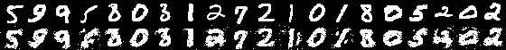

# Simple MNIST Autoencoder

## Requirements
- `MNIST`
- `Images` and `imagemagick` for output images
- `JLD` for save/load the Flux model

## Run

The main script is `mnist.jl`.

```shell
julia --color=yes mnist.jl
```

By default, you will get a jld file named `model.jld` and
a sample output image `sample.png`.

## Generate your own fake images

The script `io.jl` provides two handy functions:
  - `outputimg`
  - `outputimgs`

```julia
julia> include("./model.jl");

julia> m
Chain(Chain(Dense(784, 128, NNlib.relu)), Chain(Dense(128, 784, NNlib.relu)))

julia> include("./io.jl");

julia> restoremodel!("./model.jld", m)

julia> using MNIST

julia> tx, _ = testdata();

julia> outputimgs("myimg.png", tx[:, 1:10])
```


