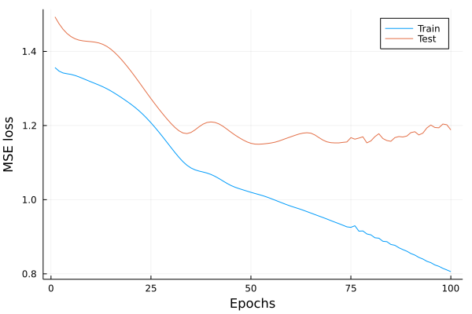

# Autoregressive Model

An [autoregressive (AR) process](https://en.wikipedia.org/wiki/Autoregressive_model) is a stochastic process with an autoregressive structure, i.e., past realizations influence its future realizations.

This model-zoo example illustrates how to use Flux's recurrent layers to model an AR process.

The example contains the following files:
+ [utils.jl](utils.jl): 
    + `generate_process`: generates an AR process
    + `batch_timeseries`: transforms a vector into the proper format for recurrent layers in Flux and allows to batch the time series as required.

+ [model.jl](model.jl): creates and trains the recurrent model to predict the generated AR process.

## Example loss

Running the model with the hyperparameters currently given in the example, we obtain the following train and test losses. We see that the model begins to overfit after around 30 epochs.

