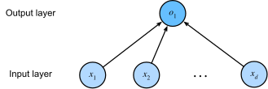

# Housing data example



Source: [Dive into Deep Learning](http://d2l.ai/chapter_linear-networks/linear-regression.html#from-linear-regression-to-deep-networks)

## Model Info

In this example, we create a linear regression model that predicts housing data. It replicates the housing data example from the [Knet.jl readme](https://github.com/denizyuret/Knet.jl). Although we could have reused more of Flux (see the MNIST example), the library's abstractions are very lightweight and don't force you into any particular strategy.

A linear model can be created as a neural network with a single layer. The number of inputs is the same as the features that the data has. Each input is connected to a single output with no activation function. Then, the output of the model is a linear function that predicts unseen data. 

## Training
To run this example:

```script
cd other/housing/
julia --project housing.jl
```

## Reference

* [Aston Zhang, Zachary C. Lipton, Mu Li and Alexander J. Smola, "Dive into Deep Learning", 2022](http://d2l.ai/chapter_linear-networks/linear-regression.html#from-linear-regression-to-deep-networks)
