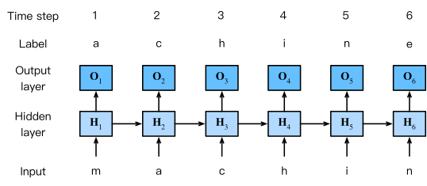

# RNN Character level



[Source](https://d2l.ai/chapter_recurrent-neural-networks/rnn.html#rnn-based-character-level-language-models)

## Model information

 A recurrent neural network (RNN) outputs a prediction and a hidden state at each step of the computation. The hidden state captures historical information of a sequence (i.e. the neural network has memory) and the output is the final prediction of the model. We use this type of neural network to model sequences such as text or time series. 


## Training

```shell
cd text/char-rnn
julia --project char-rnn.jl
```

## References

* [The Unreasonable Effectiveness of Recurrent Neural Networks](http://karpathy.github.io/2015/05/21/rnn-effectiveness/)
* [Understanding LSTM Networks](https://colah.github.io/posts/2015-08-Understanding-LSTMs/)
* [Aston Zhang, Zachary C. Lipton, Mu Li and Alexander J. Smola, "Dive into Deep Learning", 2020](https://d2l.ai/chapter_recurrent-neural-networks/rnn.html#rnn-based-character-level-language-models)

