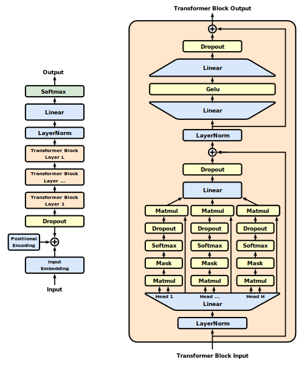

# Generative pre-trained transformer



[Source](https://en.wikipedia.org/wiki/Generative_pre-trained_transformer)

## Model Information

GPT is built of a multi-head attention architecture.  We offer here a very small instance based on Andrej Karpathy's [nanoGPT](https://github.com/karpathy/nanoGPT).  The default parameters give a model much smaller than nanoGPT, tuned for fastest convergence on a very small data set (Shakespeare).

This model takes as input a sequence of existing text (context) and produces as output the predicted next character.  Actually, it produces the predicted next character for each initial sub-sequence of the input, in effect giving an extra degree of parallelism for the purposes of training.

For the attention mechanism, we use [Flux.MultiHeadAttention](https://fluxml.ai/Flux.jl/stable/reference/models/layers/#MultiHeadAttention).


## Training

```shell
cd text/gpt
julia --project gpt.jl
```

## Example output

After one epoch:

    generate(model, "_", 50) = "_me, but plept fairs, And heards, verchean my word"
    generate(model, "_", 50) = "_ows know yought, This alce! totether him. weliest"
    generate(model, "The", 50) = "These prurd passtion?  CINCESSIT: He eloucy I must"
    generate(model, "The", 50) = "The bitherse dresic in to so shall with a his the "

After 20 epochs:

    generate(model, "_", 50) = "_ething a calling do me diseases Of, on he's to th"
    generate(model, "_", 50) = "_ ragg Thou flatters all in wators the selfsarut o"
    generate(model, "The", 50) = "The Mirtouggake Go: For my mischance lords his sea"
    generate(model, "The", 50) = "The oll-gakemoremo his dead: All this man make gen"

## References

* [Attention is all you need](https://proceedings.neurips.cc/paper_files/paper/2017/file/3f5ee243547dee91fbd053c1c4a845aa-Paper.pdf)
* [Youtube (3blue1brown): Attention in transformers, visually explained](https://www.youtube.com/watch?v=eMlx5fFNoYc)
* [Youtube (Karpathy): Let's build GPT: from scratch, in code, spelled out](https://www.youtube.com/watch?v=kCc8FmEb1nY)
* [nanoGPT](https://github.com/karpathy/nanoGPT)
