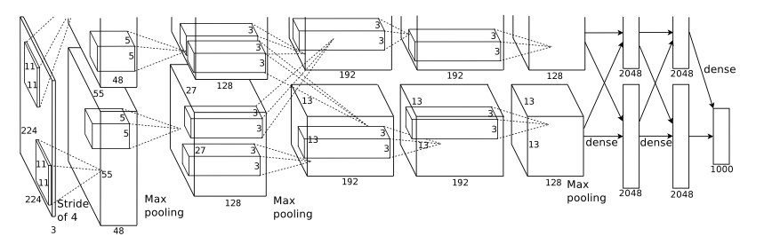

# AlexNet

<p align="center">
  
</p>

The neural network, which has 60 million parameters and 650,000 neurons, consists of five convolutional layers, some of which are followed by max-pooling layers, and three fully-connected layers with a final 1000-way softmax. To make train- ing faster, we used non-saturating neurons and a very efficient GPU implemen- tation of the convolution operation. To reduce overfitting in the fully-connected layers we employed a recently-developed regularization method called “dropout” that proved to be very effective. We also entered a variant of this model in the ILSVRC-2012 competition and achieved a winning top-5 test error rate of 15.3%, compared to 26.2% achieved by the second-best entry.

> Source : [ImageNet Classification with Deep Convolutional Neural Networks](https://papers.nips.cc/paper/2012/file/c399862d3b9d6b76c8436e924a68c45b-Paper.pdf)

### Train
```julia
cd vision/alexnet_cifar10
julia alexnet_cifar10.jl
```

### References
- [ImageNet Classification with Deep Convolutional Neural Networks](https://papers.nips.cc/paper/2012/file/c399862d3b9d6b76c8436e924a68c45b-Paper.pdf)
- [Pytorch implementation](https://github.com/pytorch/vision/blob/main/torchvision/models/alexnet.py)
