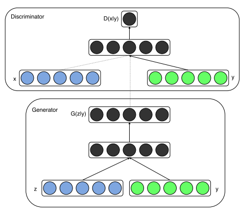
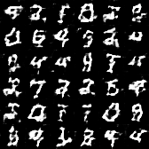
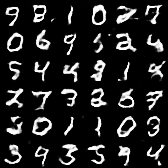
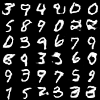
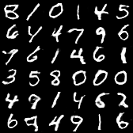
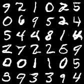

# Conditional DC-GAN



[Source](https://arxiv.org/pdf/1411.1784.pdf)

## Model Info

Generative Adversarial Networks have two models, a _Generator model G(z)_ and a _Discriminator model D(x)_, in competition with each other. G tries to estimate the distribution of the training data and D tries to estimate the probability that a data sample came from the original training data and not from G. During training, the Generator learns a mapping from a _prior distribution p(z)_ to the _data space G(z)_. The discriminator D(x) produces a probability value of a given x coming from the actual training data.
This model can be modified to include additional inputs, y, on which the models can be conditioned. y can be any type of additional inputs, for example, class labels. _The conditioning can be achieved by simply feeding y to both the Generator — G(z|y) and the Discriminator — D(x|y)_.

## Training

```shell
cd vision/cdcgan_mnist
julia --project cGAN_mnist.jl
```

## Results

1000 training steps



3000 training steps



5000 training steps



10000 training steps



11725 training steps



## References

* [Mirza, M. and Osindero, S., “Conditional Generative Adversarial Nets”, <i>arXiv e-prints</i>, 2014.](https://arxiv.org/pdf/1411.1784.pdf)

* [Training a Conditional DC-GAN on CIFAR-10](https://medium.com/@utk.is.here/training-a-conditional-dc-gan-on-cifar-10-fce88395d610)
