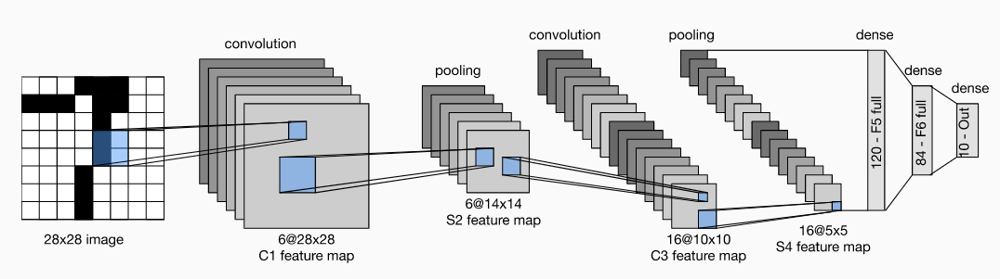

# LeNet-5



[Source](https://d2l.ai/chapter_convolutional-neural-networks/lenet.html)

## Model Info

At a high level LeNet (LeNet-5) consists of two parts:
(i) _a convolutional encoder consisting of two convolutional layers_;
(ii) _a dense block consisting of three fully-connected layers_

The basic units in each convolutional block are a convolutional layer, a sigmoid activation function, and a subsequent average pooling operation. Each convolutional layer uses a  5×5  kernel and a sigmoid activation function. These layers map spatially arranged inputs to a number of two-dimensional feature maps, typically increasing the number of channels. The first convolutional layer has 6 output channels, while the second has 16. Each  2×2  pooling operation (stride 2) reduces dimensionality by a factor of  4  via spatial downsampling. The convolutional block emits an output with shape given by (batch size, number of channel, height, width).

>**Note:** The original architecture of Lenet5 used the sigmoind activation function. However, this is a a modernized version since it uses the RELU activation function instead.

## Training

```shell
cd vision/conv_mnist
julia --project conv_mnist.jl
```

## References

* [Y. Lecun, L. Bottou, Y. Bengio and P. Haffner, "Gradient-based learning applied to document recognition," in Proceedings of the IEEE, vol. 86, no. 11, pp. 2278-2324, Nov. 1998, doi: 10.1109/5.726791.](http://yann.lecun.com/exdb/publis/pdf/lecun-01a.pdf)

* [Aston Zhang, Zachary C. Lipton, Mu Li and Alexander J. Smola, "Dive into Deep Learning", 2020](https://d2l.ai/chapter_convolutional-neural-networks/lenet.html)
