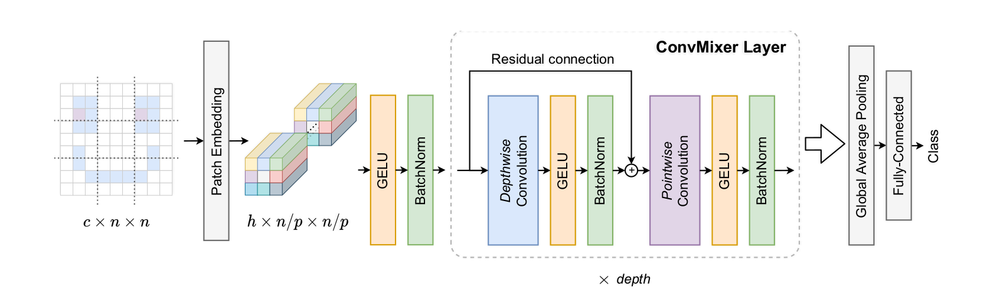

# ConvMixer



From the preprint [Patches are all you need? 🤷](https://openreview.net/forum?id=TVHS5Y4dNvM). 

## Architecture 

The first layer of the ConvMixer architecture is a patch-splitting encoded with a strided convolution. The rest is a stack of residual convolutional networks with alternationg channel-wise and space-wise convolutions. Each layer is followed by a classical Batch Normalization and all the activations are Gaussian Linear Units (GeLU). This architecture was not designed to be state-of-the-art competitive, but to reach very high accuracies without theoretical complexities, by exploiting patch segmentation of images. 

The network is trained on CIFAR10 by minimizing the cross-entropy loss with the ADAM optimizer, with Weight Decay and Gradient Clipping. 

## Training

```
cd vision/convmixer_cifar10
julia --project convmixer.jl
```

The chosen parameters are the smallest for which the architecture reaches an acceptable accuracy. Training for ~100 epochs should result in a 74\% validation error. With a depth of 32 and a width of 256, one can reach 85\% without data augmentation.  

## Reference

- https://openreview.net/forum?id=TVHS5Y4dNvM
