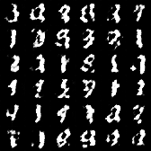
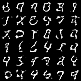
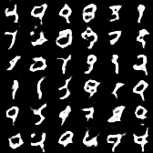
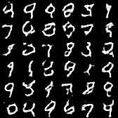

# Deep Convolutional GAN (DC-GAN)


[Source](https://gluon.mxnet.io/chapter14_generative-adversarial-networks/dcgan.html)

## Model Info

A DC-GAN is a direct extension of the GAN, except that it explicitly uses convolutional and transposed convolutional layers in the discriminator and generator, respectively. The discriminator is made up of strided convolutional layers, batch norm layers, and LeakyReLU activations. The generator is comprised of transposed convolutional layers, batch norm layers, and ReLU activations.

## Training

```script
cd vision/dcgan_mnist
julia --project dcgan_mnist.jl
```

## Results

2000 training steps



5000 training steps



8000 training steps



9380 training steps



## References

* [Radford, A. et al.: Unsupervised Representation Learning with Deep Convolutional Generative    Adversarial Networks, http://arxiv.org/abs/1511.06434, (2015).](https://arxiv.org/pdf/1511.06434v2.pdf)

* [pytorch.org/tutorials/beginner/dcgan_faces_tutorial](https://pytorch.org/tutorials/beginner/dcgan_faces_tutorial.html)
