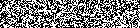
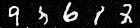
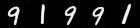
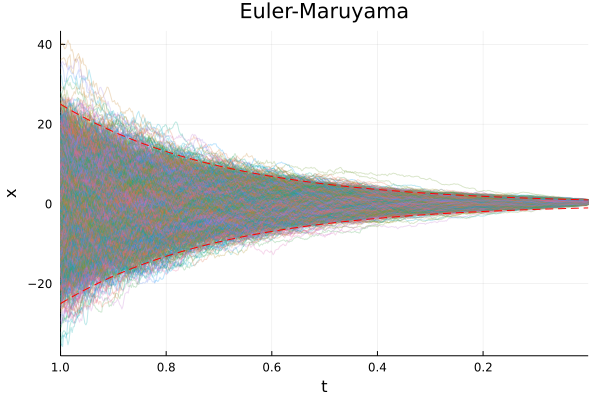
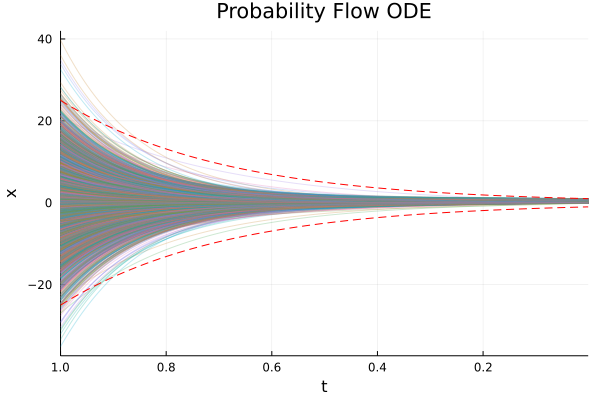

# Score-Based Generative Modeling (Diffusion Model)

[Source](https://yang-song.github.io/blog/2021/score/#score-based-generative-modeling-with-stochastic-differential-equations-sdes)

## Model Info
*Score-Based Generative Modeling* is a framework to learn stochastic dynamics that transitions one distribution to another. In our case, we will be modeling the transition from the MNIST image distribution into random noise. The general idea is to learn the forward dynamics (*score function* or *gradients*) of the image's distribution being slowly evolved into random gaussian noise through a *diffusion process*. This is shown in the image above with the **Forward Stochastic Differential Equation (SDE)**. With estimates of how the forward dynamics works, we can then reverse the process allowing us to create realistic looking images from pure noise! This is shown with the **Reverse SDE** in the graphic above.

In contrast to likelihood based models, *Score-Based Generative Modeling* depends only on the *score function*, $\nabla_x \log{p(x)}$ which is minimized through *score matching*. **Concretely, this tutorial will be using a UNet architecture and score matching loss function to learn this score function**. After this gradient is estimated, we can then draw samples from the MNIST dataset using **Langevin Dynamics** of the reverse SDE.

### More Model Info
A much more in-depth walkthrough of the theory is available [here](https://yang-song.github.io/blog/2021/score/) from the original author, [Yang Song](https://yang-song.github.io/). I highly recommend this blog to become more familiar with the concepts before diving into the code!

### Pytorch Equivalent Code
For those coming from Python, [here](https://colab.research.google.com/drive/120kYYBOVa1i0TD85RjlEkFjaWDxSFUx3?usp=sharing) is the equivalent Pytorch code that was used to create this Julia tutorial.

## Training
```shell
cd vision/diffusion_mnist
julia --project diffusion_mnist.jl
```

## Visualization
```shell
cd vision/diffusion_mnist
julia --project diffusion_plot.jl
```
Visualizations are sampled with either the equations used in the [original PyTorch tutorial](https://colab.research.google.com/drive/120kYYBOVa1i0TD85RjlEkFjaWDxSFUx3?usp=sharing) or with the help of [`DifferentialEquations.jl`](https://diffeq.sciml.ai/stable/).
| <center> Sampled Noise </center>|<center>  Euler-Maruyama (EM) Sampler </center>|<center> Predictor Corrector Sampler </center>| 
| ----------- | ----------- | ----------- |
| <center>  </center>|<center>  </center>|<center>  </center>| 

| <center> Euler-Maruyama (`DifferentialEquations.jl`) </center>| <center> Probability Flow ODE (`DifferentialEquations.jl`) </center>|
| ----------- | ----------- |
| <center>  </center>| <center>  </center>|

And since the `DifferentialEquations.jl`'s `solve()` returns the entire sample path, it is easy to visualize the reverse-time SDE sampling process as an `animation`:  


| <center> Euler-Maruyama </center>| <center> Probability Flow ODE </center>|
| ----------- | ----------- |
| <center>  </center>|<center>  </center>|

And finally, we can visualize the components of the image, `𝙭`, as a function of `t ∈ [1, ϵ]`. As noted by the authors, the Probability Flow ODE captures the same
marginal probability density 𝒫ₜ(𝙭) as it's stochastic counterpart.
| | |
| ----------- | ----------- |
| <center>  </center>| <center>  </center>|

The lines, `x(t) = ± σᵗ`, are shown for referenece.

## References

* [Yang Song. “Generative Modeling by Estimating Gradients of the Data Distribution.” Blog Post, 2021](https://yang-song.github.io/blog/2021/score/)

* [Yang Song, Jascha Sohl-Dickstein, Diederik P. Kingma, Abhishek Kumar, Stefano Ermon, and Ben Poole. "Score-Based Generative Modeling Through
Stochastic Differential Equations". ArXiv Preprint, 2021](https://arxiv.org/pdf/2011.13456.pdf)

