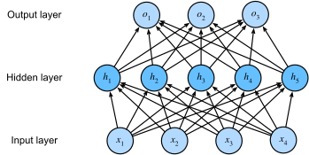

# Multilayer Perceptron (MLP)



[Source](http://d2l.ai/chapter_multilayer-perceptrons/mlp.html)

## Model Info

A [multi-layer perceptron](https://en.wikipedia.org/wiki/Multilayer_perceptron) (MLP) consists of at least three sets of of nodes: an input layer, one or more hidden layer and an output layer. Each node except for the input node is a neuron that uses a nonlinear activation function. The multiple layers and non-linearities allow an MLP to distinguish data that is not linearly separable once trained.

In this example, we create a MLP that classifies handwritten digits using the [MNIST dataset](http://yann.lecun.com/exdb/mnist/).
Our model uses the simplest [Flux layers](http://fluxml.ai/Flux.jl/stable/models/layers/), namely `Dense` and `Chain`.
Since it uses [softmax](https://en.wikipedia.org/wiki/Softmax_function) on its outputs, and [`crossentopy`](http://fluxml.ai/Flux.jl/stable/models/losses/#Flux.Losses.crossentropy) as the loss function.

For simplicity this model does not use a graphics card, since an ordinary CPU is fast enough.
See for example the [LeNet convolutional network](https://github.com/FluxML/model-zoo/tree/master/vision/conv_mnist) for GPU usage.

## Training

You can copy and paste the example into the Julia REPL to see what each part does.
Or you can run it all at once from the terminal, like this:

```script
cd vision/mlp_mnist
julia --project mlp_mnist.jl
```

## Reference

* [Aston Zhang, Zachary C. Lipton, Mu Li and Alexander J. Smola, "Dive into Deep Learning", 2020](http://d2l.ai/chapter_multilayer-perceptrons/mlp.html)
* [3Blue1Brown Neural networks videos](https://www.youtube.com/watch?v=aircAruvnKk&list=PLZHQObOWTQDNU6R1_67000Dx_ZCJB-3pi)
* [Neural Networks and Deep Learning](http://neuralnetworksanddeeplearning.com/)
 