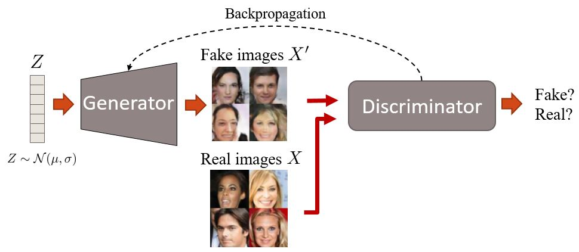
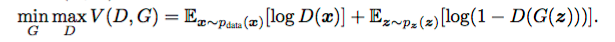

# Generative Adversarial Network Tutorial

Generative Adversarial Nets (GAN), are generative models used to infer a complicated probability distribution.

We have two networks competing against each other - The Generator and the discriminator.



The first net generates data from randomly sampled noise, and the second net tries to tell the difference between the real data and the fake data generated by the first net.

The formulation per se involves the following min-max objective :



At equilibrium, the discriminator will output a probability of 0.5 for each generated image.

## Run the script

```
julia dcgan.jl
```

*This page was generated using [Literate.jl](https://github.com/fredrikekre/Literate.jl).*

