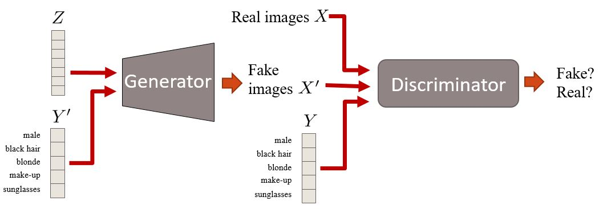

# Conditional Generative Adversarial Network Tutorial

A cGAN is a GAN wherein both the generator and the discriminator are fed prior labels along with the image and random noise.

It models the conditional probabilities conditioned on the labels.



## Run the script 

```
julia cgan.jl
```

*This page was generated using [Literate.jl](https://github.com/fredrikekre/Literate.jl).*

