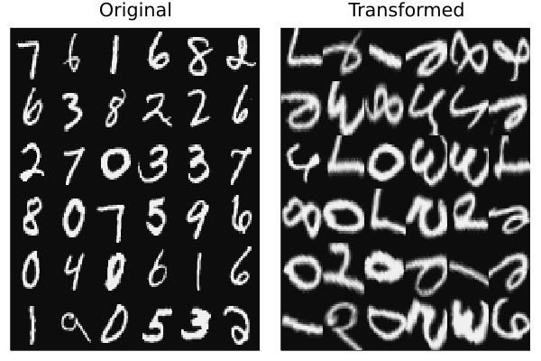

# Spatial Transformer Network

In this tutorial we'll build a spatial transformer network that will transform MNIST
digits for classification by a CNN:

* [Spatial Transformer Networks](https://proceedings.neurips.cc/paper/2015/hash/33ceb07bf4eeb3da587e268d663aba1a-Abstract.html)

Spatial transformer networks perform differentiable affine transformations on images, in this tutorial for the purpose of aiding classification of MNIST digits.

