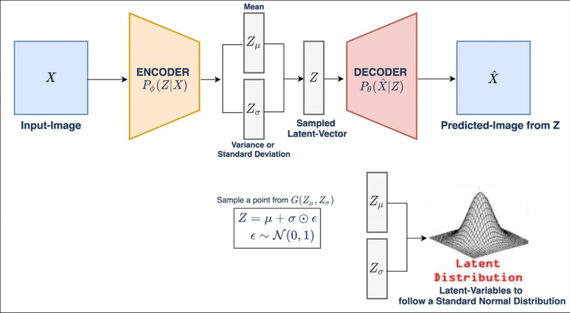
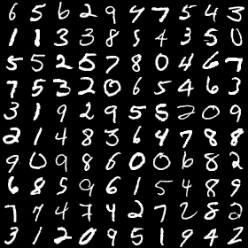
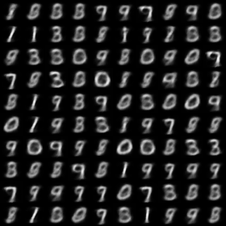
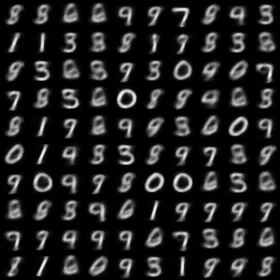
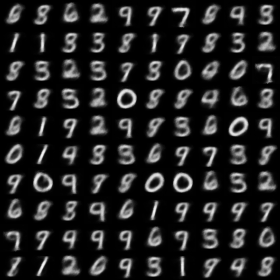
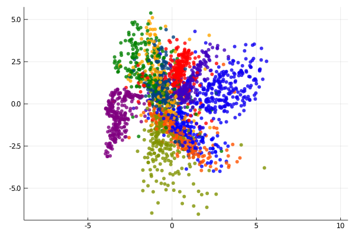
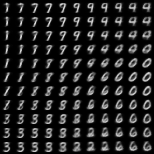

# Variational Autoencoder (VAE)



[Source](https://learnopencv.com/variational-autoencoder-in-tensorflow/#:~:text=Variational)

## Model Info

Variational Autoencoder (VAE) came into existence in 2013, when Kingma et al. published the paper [Auto-Encoding Variational Bayes](https://arxiv.org/pdf/1312.6114.pdf). This paper was an extension of the original idea of Auto-Encoder primarily to learn the distribution of the data. VAEs are devised within the variational inference framework and  approximately model the data distribution after training, making it computationally cheap to generate new samples.

In VAE the idea is to encode the input as a probability distribution rather than a point estimate as in vanilla auto-encoder. Then VAE uses a decoder to reconstruct the original input by using samples from that probability distribution.

## Training

```shell
cd vision/vae_mnist
julia --project vae_mnist.jl
```

Original image



5 epochs



10 epochs



20 epochs



## Visualization

```shell
julia --project vae_plot.jl
```

Latent space clustering



2D manifold



## References

* [Kingma, Diederik P., and Max Welling. “Auto-Encoding Variational Bayes.” ArXiv Preprint ArXiv:1312.6114, 2013.](https://arxiv.org/pdf/1312.6114.pdf)

* [Variational Autoencoder in TensorFlow](https://learnopencv.com/variational-autoencoder-in-tensorflow/#:~:text=Variational.)
