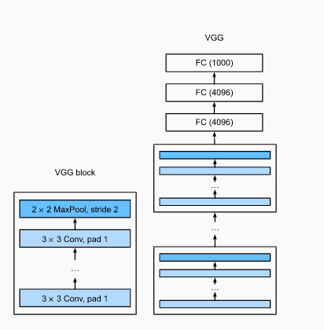

# Visual Geometry Group (VGG)



[Source](http://d2l.ai/chapter_convolutional-modern/vgg.html)

## Model Info

The basic building block of classic CNNs is a sequence of the following: (i) a convolutional layer with padding to maintain the resolution, (ii) a nonlinearity such as a ReLU, (iii) a pooling layer such as a maximum pooling layer. _One VGG block consists of a sequence of convolutional layers, followed by a maximum pooling layer for spatial downsampling_. In the original VGG paper [Simonyan & Zisserman, 2015](https://arxiv.org/pdf/1409.1556v4.pdf), the authors employed convolutions with  3×3  kernels with padding of 1 (keeping height and width) and  2×2  maximum pooling with stride of 2 (halving the resolution after each block).

## Training

```shell
cd vision/vgg_cifar10
julia --project vgg_cifar10.jl
```

## References

* [Simonyan, K. and Zisserman, A., “Very Deep Convolutional Networks for Large-Scale Image Recognition”, <i>arXiv e-prints</i>, 2015.
](https://arxiv.org/pdf/1409.1556v4.pdf)

* [Aston Zhang, Zachary C. Lipton, Mu Li and Alexander J. Smola, "Dive into Deep Learning", 2020](http://d2l.ai/chapter_convolutional-modern/vgg.html)
